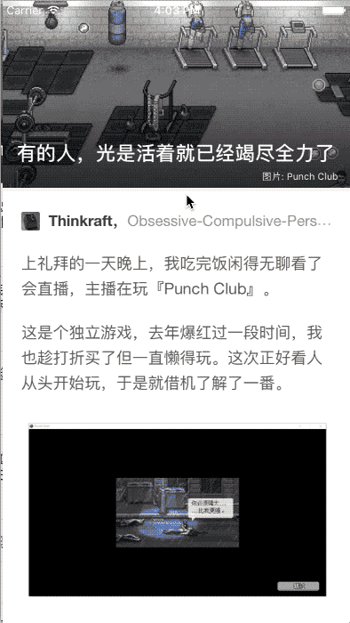
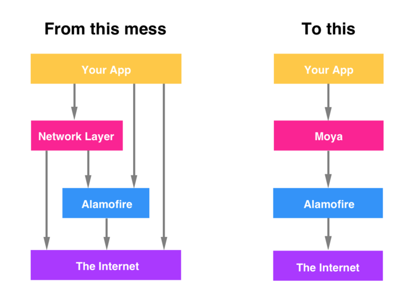

# ZhiHu-RxSwift
知乎日报，MVC + RxSwift,适合RxSwift初学者的项目。  
 
[RxSwift 社区](https://github.com/RxSwiftCommunity?language=swift&page=2&q=&type=&utf8=%E2%9C%93)  
[参考项目地址](https://github.com/kLike/ZhiHu-RxSwift)   
[接口地址](./resources/知乎日报部分api.html)
## 展示: 

 
## 依赖库
- [Moya](https://github.com/Moya/Moya)在[Alamofire](https://github.com/Alamofire/Alamofire)的基础上又封装了一层,如下Moya的简单工作流程图[基础用法](http://www.cocoachina.com/ios/20180307/22493.html)
  

- [Kingfisher](https://github.com/onevcat/Kingfisher)Swift中的SDWebImage  
- [RxSwift](https://github.com/ReactiveX/RxSwift)基于Swift的Rx标准实现接口库，RxSwift不包含任何Cocoa或者UI方面的类    
- [RxCocoa](https://github.com/ReactiveX/RxSwift)通过Extension的方法给原生UI控件添加了Rx特性，使得我们更容易订阅和响应这些控件的事件  
- [Then](https://github.com/devxoul/Then)Swift语法糖  
- [RxDataSources](https://github.com/RxSwiftCommunity/RxDataSources)把UITableViewDataSource和  UITableViewDelegate的代理封装成了响应式编程的风格  
- [SwiftDate](https://github.com/malcommac/SwiftDate)轻松自如地管理日期和时区    
待完善...  